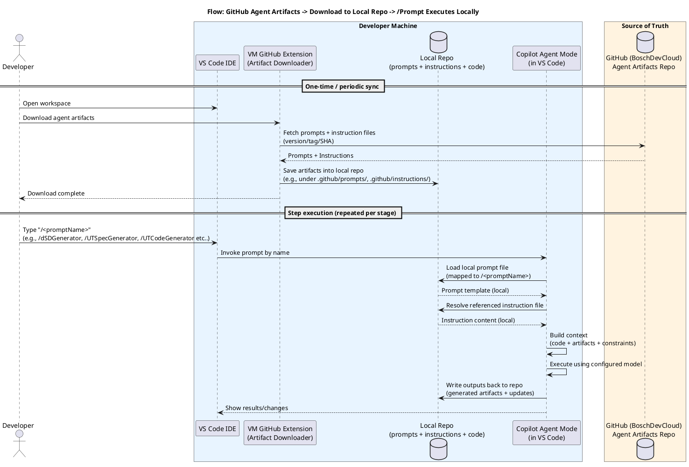

# Orchestrated Workflow for AI-Assisted Software Development

## 1. Introduction

### 1.1 Purpose

This document describes the **Orchestrated Workflow** — a structured, prompt-driven development process that leverages GitHub Copilot Agent Mode within VS Code to automate and standardize key stages of software component development. The workflow enables developers to produce consistent, high-quality engineering artifacts (design documents, unit test specifications, unit test code, etc.) by executing curated prompts that encode organizational standards, coding rules, and domain-specific knowledge.

### 1.2 Scope

The orchestrated workflow covers:

- **Artifact management**: Centralized storage, versioning, and distribution of prompt files, instruction files, and memory files.
- **Stage-based execution**: Sequential or on-demand execution of development stages via named prompts (e.g., `/dSDGenerator`, `/UTSpecGenerator`, `/UTCodeGenerator`).
- **Quality gates**: Built-in validation checkpoints and review checklists enforced at each stage.
- **Context engineering**: Automated assembly of code, requirements, design decisions, and prior learnings into the AI agent's context window.
- **Memory and learning**: Persistent capture of corrections and learnings across sessions via agent memory files.

### 1.3 Target Audience

- Software Component Responsibles
- Software Architects and Technical Leads
- Quality Assurance and Technical Reviewers
- Development Teams adopting AI-assisted workflows

### 1.4 Terminology

| Term | Definition |
|------|-----------|
| **Agent Artifacts** | Prompts (`.prompt.md`), instructions (`.instructions.md`), and memory files (`.memory.md`) that configure and guide Copilot Agent Mode. |
| **Prompt** | A structured markdown file that defines a specific task for the AI agent, including role, inputs, outputs, execution gates, and referenced instructions. |
| **Instruction File** | A reusable set of rules, templates, and guidelines that prompts reference to enforce standards and conventions. |
| **Memory File** | A persistent file where new learnings and corrections are recorded during agent execution, available to future sessions. |
| **Stage** | A discrete phase in the development workflow (e.g., design document creation, design document review, unit test specification generation). |
| **Execution Gate** | A mandatory checkpoint within a stage that must pass before the agent proceeds to the next step. |

---

## 2. Architecture Overview

### 2.1 System Flow Diagram

The following diagram illustrates the end-to-end flow from artifact distribution to local prompt execution:



### 2.2 Key Architectural Principles

1. **Local-First Execution**: All prompt execution happens locally in VS Code. No source code or proprietary data leaves the developer's machine during agent execution.
2. **Centralized Artifact Source**: Prompts and instructions are maintained in a single GitHub repository as the source of truth. Memory files are local to each developer's workspace.
3. **Latest-File Sync**: The extension downloads the latest version of prompts and instructions from the central repository, ensuring developers always work with the most current standards and templates.
4. **Separation of Concerns**: Prompts define *what* to do; instructions define *how* to do it; memory captures *what was learned*. This separation allows independent evolution of each layer.
5. **Gate-Driven Quality**: Every stage embeds mandatory execution gates that enforce prerequisites, template compliance, and technical accuracy before the agent may proceed.

---

## 3. Artifact Repository Structure

### 3.1 Directory Layout

Agent artifacts reside under the `.github/` directory within the local repository:

```
.github/
├── prompts/                              # Prompt files (one per workflow stage)
│   ├── 1_<StageN>.prompt.md              # e.g., 1_DetailedSoftwareDesign.prompt.md
│   ├── 1_1_<StageN_Review>.prompt.md     # e.g., 1_1_DSDesign_ReviewChecklist.prompt.md
│   ├── 2_<StageN>.prompt.md              # e.g., 2_UTSpecGenerator.prompt.md
│   └── 3_<StageN>.prompt.md              # e.g., 3_UTCodeGenerator.prompt.md
├── instructions/                          # Instruction files (reusable rules & templates)
│   ├── 1_<StageN>.instructions.md        # Stage-specific design/generation rules
│   ├── 1a_<CodingRules>.instructions.md  # Organization coding standards
│   └── 1b_<ReviewChecklist>.instructions.md  # Review criteria and quality gates
└── memory/                                # Memory files (persistent learnings)
    └── <stageName>Learnings.memory.md     # e.g., dsdLearnings.memory.md
```

### 3.2 Artifact Types

| Artifact Type | File Pattern | Purpose | Lifecycle |
|---------------|-------------|---------|-----------|
| **Prompt** | `*.prompt.md` | Defines a complete agent task with role, inputs, outputs, gates, and instruction references. | Versioned centrally; synced to local repo. |
| **Instruction** | `*.instructions.md` | Provides reusable rules, templates, checklists, and coding standards for prompts to reference. | Versioned centrally; synced to local repo. Can have `applyTo` globs for auto-attachment. |
| **Memory** | `*.memory.md` | Records learnings, corrections, and user preferences discovered during agent execution. | Created and maintained locally on the developer's machine; not synced from the central repository. |

### 3.3 Artifact Versioning and Sync

- Prompts and instructions are stored in the **centralized GitHub Agent Artifacts Repository**.
- The **VS Code Extension** (Artifact Downloader) fetches the latest prompts and instructions from the repository.
- Sync is a **one-time or periodic** operation — developers trigger it manually when they want updated artifacts.
- Local modifications to prompts and instructions are permitted for experimentation but should be upstreamed to the central repository for team consistency.
- **Memory files are local only** — they reside on the developer's machine under `.github/memory/` and are not part of the centralized sync process.

---

## 4. Workflow Stages

The orchestrated workflow is composed of three core stages that repeat for each type of artifact being produced. Each stage is **independently triggered by the developer** — there is no automatic chaining or triggering between stages. The developer decides when to invoke each stage and in what order. The stages are designed to be generic — the same pattern applies whether the artifact is a design document, a test specification, source code, or any other engineering output.

### 4.1 Stage Pipeline Overview

```
┌───────────────────────────────┐
│  Stage 1: Artifact Generation │──▶ Generated artifact (e.g., design doc, test spec, code)
│  /<artifactGenerator>         │
│  (LLM A)                     │
│  [Developer-triggered]        │
└───────────────────────────────┘

┌───────────────────────────────┐
│  Stage 2: Artifact Review     │──▶ Review verdict + findings report
│  /<artifactReview>            │
│  (LLM B — different model)   │
│  [Developer-triggered]        │
└───────────────────────────────┘

┌───────────────────────────────┐
│  Stage 3: Trigger Learnings   │──▶ Updated memory file with new learnings
│  /<triggerLearnings>          │    (optional)
│  (any LLM)                   │
│  [Developer-triggered]        │
└───────────────────────────────┘
```

**Key design decisions:**
- **All stages are developer-triggered** — no stage automatically invokes another. The developer retains full control over when and whether to proceed to the next stage.
- **Stage 1 and Stage 2 intentionally use different LLMs** to introduce model diversity during review, reducing the risk of confirmation bias where the same model validates its own output patterns.
- **Stage 3 is optional** — the developer decides whether learnings from the current session are worth capturing. This avoids polluting the memory file with noise and keeps future context lean.

---

### 4.2 Stage 1 — Artifact Generation

**Prompt**: `N_<ArtifactName>.prompt.md` (e.g., `1_DetailedSoftwareDesign.prompt.md`, `2_UTSpecGenerator.prompt.md`)
**Invocation**: `/<artifactGenerator>` (e.g., `/dSDGenerator`, `/UTSpecGenerator`, `/UTCodeGenerator`)
**Model**: Configured per prompt (e.g., Claude Sonnet 4.6)

#### Purpose
Generates a specific engineering artifact by assembling context from source code, requirements, design decisions, prior artifacts, and the local memory file, then applying the rules and templates defined in the referenced instruction files.

#### Inputs
| Input | Source | Description |
|-------|--------|-------------|
| Target component directory | Local repo (e.g., `<component>/`) | Complete source structure with relevant subdirectories. |
| Prerequisite artifacts | Local repo (e.g., `doc/req-as-code/`, `doc/docs-as-code/`) | Upstream artifacts that this stage depends on (e.g., requirements for design, design for test specs). |
| Existing artifact (optional) | Local repo | For incremental updates to a previously generated artifact. |
| Design decisions (if applicable) | `doc/ccb_minutes/*_CCBMinutes.md` | Architectural context and change control board decisions. |
| Agent memory | `.github/memory/<stageName>Learnings.memory.md` | Prior learnings and corrections from previous sessions. |

#### Execution Gates

| Gate | Type | Description |
|------|------|-------------|
| Prerequisite Validation | STOP | Verifies that required upstream artifacts exist and have an acceptable status (e.g., `reviewed`, `approved`, `baseline`, `accepted`). |
| Instruction Loading | MANDATORY | Agent must read all referenced instruction files and the memory file before any other action. |
| Template Compliance | CHECKPOINT | Validates the generated artifact follows the structure defined in the instruction file. |
| Technical Accuracy | REVIEW | Cross-verifies all content against prerequisite artifacts, source code, and design decisions. |

#### Outputs
- Generated artifact following the instruction template structure.
- Change summary if updating an existing artifact.

#### Referenced Instruction Files
| Instruction File | Purpose |
|-----------------|---------|
| `N_<ArtifactName>.instructions.md` | Artifact-specific section template, content guidelines, and formatting rules. |
| `Na_<CodingRules>.instructions.md` | Organization-specific coding standards and naming conventions (where applicable). |

---

### 4.3 Stage 2 — Artifact Review

**Prompt**: `N_N_<ArtifactName>_Review.prompt.md` (e.g., `1_1_DSDesign_ReviewChecklist.prompt.md`)
**Invocation**: `/<artifactReview>` (e.g., `/dSDReviewChecklist`)
**Model**: Configured per prompt — **intentionally a different LLM** than Stage 1 (e.g., Claude Opus 4.6)

#### Purpose
Reviews and validates an artifact against defined review checklists and quality gate criteria. The developer triggers this stage independently after inspecting the Stage 1 output. Using a different LLM from the generation stage introduces independent evaluation, reducing the likelihood that systematic biases in the generating model go undetected.

#### Inputs
| Input | Source | Description |
|-------|--------|-------------|
| Generated artifact | Local repo | The artifact produced in Stage 1 to be reviewed. |
| Prerequisite artifacts | Local repo | Upstream artifacts for traceability and accuracy verification. |
| Target component directory | Local repo | For accuracy checks against source code. |
| Design decisions (if applicable) | `doc/ccb_minutes/*_CCBMinutes.md` | For architectural context validation. |
| Agent memory | `.github/memory/<stageName>Learnings.memory.md` | Prior learnings for review context. |

#### Review Workflow

1. **Existence and Structure Validation** — Verify the artifact exists and all required sections are present per the template.
2. **Checklist Evaluation** — Systematically evaluate the artifact against every item in the review checklist defined in the corresponding review instruction file.
3. **Technical Accuracy Verification** — Cross-verify traceability to prerequisite artifacts, design decision alignment, and internal consistency.
4. **Consolidated Review Verdict** — Produce a summary with pass/fail counts and categorized findings.

#### Finding Severity Levels

| Severity | Symbol | Description |
|----------|--------|-------------|
| Critical | RED | Blocks approval — gaps in critical areas, missing required sections, incorrect traceability. |
| Major | ORANGE | Must be addressed — incomplete content, missing diagrams, inconsistencies. |
| Minor | YELLOW | Should be addressed — formatting issues, minor omissions, style deviations. |
| Observation | BLUE | Optional improvement — suggestions for clarity or enhancement. |

#### Outputs
- Completed review checklist with pass/fail status for each item.
- Categorized findings list with severity classification.
- Actionable recommendations for each finding.
- Overall verdict: **Approved** / **Approved with conditions** / **Rejected**.

---

### 4.4 Stage 3 — Trigger Learnings (Optional)

**Prompt**: `N_N_N_<TriggerLearnings>.prompt.md` (e.g., `1_1_1_TriggerLearnings.prompt.md`)
**Invocation**: `/<triggerLearnings>` (e.g., `/triggerLearnings`)
**Model**: Any available LLM

#### Purpose
Captures corrections, insights, and user preferences discovered during the generation and review stages into the local memory file. This stage is **optional and user-triggered** — the developer decides whether the current session produced learnings worth persisting.

#### Why This Stage Is Optional
- Not every session produces new learnings. Automatically capturing after every run would pollute the memory file with redundant or low-value entries.
- By making it user-triggered, the developer acts as a quality filter, ensuring only genuinely useful context is retained.
- This keeps the memory file lean, so future sessions benefit from focused learnings rather than an ever-growing blob of context that consumes the agent's context window.

#### When to Trigger
- The developer provided corrections during Stage 1 or Stage 2 that are not already captured in instruction files.
- The agent made assumptions or interpretations that should be guided differently in future runs.
- A pattern or convention was clarified during the session that would benefit future artifact generation.

#### Inputs
| Input | Source | Description |
|-------|--------|-------------|
| Current session context | Copilot chat history | Corrections, feedback, and clarifications provided during the session. |
| Existing memory file | `.github/memory/<stageName>Learnings.memory.md` | Current learnings to avoid duplicating existing entries. |
| Instruction files | `.github/instructions/` | To verify the learning is not already covered by existing rules. |

#### Outputs
- Updated memory file with new dated entries appended.
- Each entry captures *what was learned* and *why it matters* for future sessions.

#### Memory Entry Format
```markdown
### YYYY-MM-DD — Short title
What was learned and why it matters.
```

#### Constraints
- **No duplication**: Only record learnings not already present in instruction files or the existing memory file.
- **Scoped entries**: Each entry should be concise and actionable — not a session transcript.
- **Local only**: The memory file stays on the developer's machine and is not synced to the central repository.

---

## 5. Execution Model

### 5.1 Context Engineering

When a prompt is invoked, the Copilot Agent Mode assembles context from multiple sources:

```
┌──────────────────────────────────────────────┐
│              Agent Context Window             │
│                                               │
│  ┌─────────────┐  ┌──────────────────────┐   │
│  │ Prompt File  │  │ Instruction Files    │   │
│  │ (task def)   │  │ (rules & templates)  │   │
│  └─────────────┘  └──────────────────────┘   │
│                                               │
│  ┌─────────────┐  ┌──────────────────────┐   │
│  │ Memory File  │  │ Source Code &        │   │
│  │ (learnings)  │  │ Artifacts (codebase) │   │
│  └─────────────┘  └──────────────────────┘   │
│                                               │
│  ┌────────────────────────────────────────┐   │
│  │ Requirements + CCB Minutes + Configs   │   │
│  └────────────────────────────────────────┘   │
└──────────────────────────────────────────────┘
```

The agent uses tools (`codebase`, `search`, `editFiles`) to dynamically expand its context by reading files from the local repository as needed.

### 5.2 Instruction Auto-Attachment

Instruction files can declare an `applyTo` glob pattern in their YAML front matter. When a file matching the pattern is involved in the agent's context, the instruction is automatically loaded:

```yaml
---
applyTo: "**/doc/**/*.md"
description: "Detailed Software Design (DSD) creation guidelines"
---
```

This ensures that relevant rules are always active when working with matching file types, without requiring explicit developer action.

### 5.3 Agent Memory Mechanism

The memory file (e.g., `.github/memory/<stageName>Learnings.memory.md`) provides cross-session learning:

- **Read on startup**: Every prompt mandates reading the memory file as a prerequisite step.
- **Write during execution**: When the agent encounters corrections or discovers something not covered by instructions, it immediately appends a dated entry.
- **Accumulative**: The memory file grows over time, building a project-specific knowledge base.
- **Scoped**: Only genuinely new learnings are recorded — information already in instruction files or source code is not duplicated.

**Memory Entry Format:**
```markdown
### YYYY-MM-DD — Short title
What was learned and why it matters.
```

---

## 6. Developer Workflow

### 6.1 Initial Setup

1. **Open workspace** in VS Code containing the software component repository.
2. **Install the VM AI VS Code Extension** (Artifact Downloader) if not already installed.
3. **Download agent artifacts** using the extension:
   - Specify which BU you belongs to and which agentic workflow stage(s) you want to work with (e.g., design document generation, test spec generation).
   - The extension fetches the latest prompts and instructions from the central GitHub repository and saves
4. **Verify artifact presence** — confirm the expected prompt, instruction, and memory files exist.

### 6.2 Executing a Workflow Stage

1. **Open Copilot Agent Mode** in VS Code (Chat panel, select Agent Mode).
2. **Type the prompt name** — e.g., `/dSDGenerator` — in the chat input.
3. **Provide context** — if prompted, specify the target component directory or file.
4. **Monitor execution** — the agent will:
   - Load the prompt file and resolve referenced instructions.
   - Execute mandatory prerequisite steps (read instructions, validate requirements).
   - Build context from source code, requirements, and prior artifacts.
   - Generate the output artifact (e.g., DSD document).
   - Apply execution gates and report any failures.
5. **Review the output** — inspect the generated artifact in the workspace diff view.
6. **Accept or iterate** — approve changes or provide corrections (which the agent records in memory).

### 6.3 Updating Artifacts

- **Periodic sync**: Re-run the artifact downloader to fetch updated prompts and instructions from the central repository.
- **Local experimentation**: Modify prompt or instruction files locally for testing. Upstream validated changes to the central repository.
- **Memory preservation**: Memory files are local to each developer's machine and are not synced. To share learnings across the team, extract relevant entries and contribute them into shared instruction files.

---

## 7. Quality Assurance Framework

### 7.1 Built-in Quality Controls

| Control | Enforcement Level | Description |
|---------|-------------------|-------------|
| **Requirement Status Gate** | Stage prerequisite | DSD creation is blocked unless requirements have an approved status. |
| **Instruction Compliance** | Template checkpoint | Generated documents must follow the section structure defined in instructions. |
| **Technical Accuracy Review** | Cross-reference | Content is verified against requirements, CCB minutes, and source code. |
| **Automated Review Checklist** | Post-creation stage | A dedicated review stage evaluates the artifact against formalized checklists. |
| **Severity-Based Findings** | Review output | Issues are categorized (Critical/Major/Minor/Observation) with actionable remediation. |
| **Approval Workflow** | Review verdict | Final verdict determines if the artifact can proceed to the next stage. |

### 7.2 Traceability

The orchestrated workflow maintains traceability across the full artifact chain:

```
Requirements (*_Req.md)
        |  traced in
        v
DSD (*_dsd.md) — Requirements Traceability Matrix
        |  derived from
        v
UT Specification (*_UTSpec.md) — Test-to-requirement mapping
        |  implemented as
        v
UT Code (*_UT.c) — Test case implementation
```

Each artifact explicitly references its predecessor, enabling bidirectional traceability from requirements to test evidence.

---

## 8. Acceptance Criteria

The following acceptance criteria define the verifiable conditions that must be satisfied for the orchestrated workflow to be considered successfully implemented and operational.

### 8.1 Artifact Management

| ID | Criterion | Verification Method |
|----|-----------|---------------------|
| AC-01 | Prompts and instruction files are stored in the centralized GitHub Agent Artifacts Repository and follow the defined directory layout (Section 3.1). | Repository inspection |
| AC-02 | The VS Code Extension (Artifact Downloader) successfully fetches the latest prompts and instructions from the central repository and saves them to the local repo under the correct paths. | Extension sync execution + file verification |
| AC-03 | Memory files are created and maintained locally on the developer's machine and are **not** included in the central sync process. | Sync operation audit |
| AC-04 | Artifact file naming follows the defined patterns: `*.prompt.md`, `*.instructions.md`, `*.memory.md`. | File system inspection |

### 8.2 Stage Execution

| ID | Criterion | Verification Method |
|----|-----------|---------------------|
| AC-05 | Each workflow stage (Generation, Review, Trigger Learnings) can be independently invoked by the developer via the corresponding prompt command (e.g., `/dSDGenerator`, `/dSDReviewChecklist`, `/triggerLearnings`). | Manual invocation test |
| AC-06 | No stage automatically triggers or chains to another stage — all transitions are developer-initiated. | Execution observation |
| AC-07 | Stage 1 (Generation) and Stage 2 (Review) use **different LLMs** as configured in their respective prompt files. | Prompt file inspection + execution logs |
| AC-08 | Stage 3 (Trigger Learnings) is optional and only records learnings when explicitly triggered by the developer. | Workflow execution without Stage 3 |

### 8.3 Execution Gates

| ID | Criterion | Verification Method |
|----|-----------|---------------------|
| AC-09 | The agent halts (STOP gate) if prerequisite artifacts are missing or do not have an acceptable status (`reviewed`, `approved`, `baseline`, `accepted`). | Test with missing/unapproved prerequisites |
| AC-10 | The agent loads all referenced instruction files and the memory file before performing any generation or review actions (MANDATORY gate). | Execution trace / agent log review |
| AC-11 | Generated artifacts conform to the section structure defined in the corresponding instruction file (CHECKPOINT gate). | Template compliance comparison |
| AC-12 | Content in generated artifacts is cross-verified against prerequisite artifacts, source code, and design decisions (REVIEW gate). | Manual review of generated content |

### 8.4 Context Engineering

| ID | Criterion | Verification Method |
|----|-----------|---------------------|
| AC-13 | The agent assembles context from prompt files, instruction files, memory files, source code, requirements, and CCB minutes as described in Section 5.1. | Agent context window audit |
| AC-14 | Instruction files with `applyTo` glob patterns are automatically loaded when matching files are in the agent's context. | Test with matching file patterns |
| AC-15 | All prompt execution occurs locally within VS Code — no source code or proprietary data is transmitted outside the developer's machine during agent execution. | Network traffic verification |

### 8.5 Memory and Learning

| ID | Criterion | Verification Method |
|----|-----------|---------------------|
| AC-16 | The memory file is read by the agent at the start of every stage execution. | Agent log / execution trace |
| AC-17 | New learnings appended to the memory file follow the prescribed format: `### YYYY-MM-DD — Short title` with a description of what was learned and why it matters. | Memory file content inspection |
| AC-18 | Duplicate entries are not recorded — learnings already present in instruction files or the existing memory file are not re-added. | Memory file review after multiple sessions |

### 8.6 Review and Quality

| ID | Criterion | Verification Method |
|----|-----------|---------------------|
| AC-19 | The review stage produces a completed checklist with pass/fail status for each review item. | Review output inspection |
| AC-20 | Findings are categorized using the defined severity levels: Critical (RED), Major (ORANGE), Minor (YELLOW), Observation (BLUE). | Review output inspection |
| AC-21 | The review stage produces an overall verdict of **Approved**, **Approved with conditions**, or **Rejected**. | Review output inspection |
| AC-22 | Traceability is maintained across the full artifact chain: Requirements → DSD → UT Specification → UT Code. | Traceability matrix verification |

### 8.7 Developer Workflow

| ID | Criterion | Verification Method |
|----|-----------|---------------------|
| AC-23 | A developer can complete the initial setup (install extension, download artifacts, verify presence) following the steps in Section 6.1 without external assistance. | New developer onboarding test |
| AC-24 | The developer can review generated artifacts via the VS Code workspace diff view and accept or iterate with corrections. | Workflow execution walkthrough |
| AC-25 | Local modifications to prompts and instructions are permitted for experimentation without disrupting the central repository. | Local edit + sync test |

---

## 9. Limitations and Considerations

| Consideration | Details |
|--------------|---------|
| **Context window limits** | Very large components may exceed the AI model's context window. Break into sub-modules and generate artifacts per sub-module. |
| **Model accuracy** | AI-generated artifacts require human review. The review stage and execution gates mitigate but do not eliminate the need for expert judgment. |
| **Artifact drift** | If central artifacts are updated but not re-synced locally, the developer works with stale prompts. Establish periodic sync discipline. |
| **Memory file growth** | Over time, memory files may grow large. Periodically curate entries — graduate stable learnings into instruction files and archive obsolete entries. |


---
