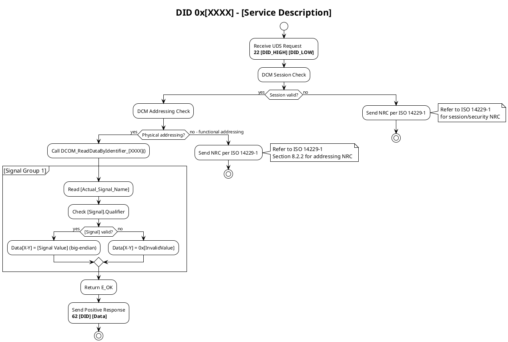

---
description: 'Standards and templates for automotive detailed software design documentation'
applyTo: 'doc/design/**/*.md'
usedBy: '.github/prompts/1-create-detailed-software-design.prompt.md'
---
# Detailed Software Design Documentation Standards

**NOTE:** This instruction file is referenced by `.github/prompts/1-create-detailed-software-design.prompt.md` which provides the workflow and execution steps for the detailed design agent. This file contains the detailed standards, templates, and quality guidelines.

---

Guidelines for creating high-quality detailed software design documentation for automotive embedded systems following ISO 26262, MISRA C, AUTOSAR, and Bosch coding standards.

## Purpose

This instruction file defines standards for creating detailed software design documentation that:

1. **Ensures Safety Compliance** - Aligns with ISO 26262 functional safety requirements and ASIL decomposition strategies
2. **Enables Implementation** - Provides complete design specifications that developers can implement without ambiguity
3. **Maintains Traceability** - Links design elements to requirements, ensuring bidirectional traceability for safety audits
4. **Facilitates Verification** - Defines test points, assertions, and verification strategies at the design level
5. **Supports Architecture** - Documents component interactions, interfaces, and system integration in accordance with AUTOSAR architecture

**Target Users:** Software architects, embedded software developers, safety engineers, integration engineers, and testers working on automotive safety-critical systems.

**Scope:** This instruction applies to all detailed software design documents in `doc/design/` that specify component-level implementation for automotive embedded systems including diagnostic services, control algorithms, and hardware abstraction layers.

**Relationship to Requirements:** Detailed Software Design documents transform requirements analysis into implementable specifications. Each design element must trace back to verified requirements and forward to test cases, supporting the complete V-model development process required by ISO 26262.

## Design Principles

All detailed software design documentation must follow these core principles:

### 1. Requirements-Driven Design

- **Principle:** Base ALL design decisions on verified requirements from requirements analysis documents
- **Rationale:** Ensures complete traceability and prevents over-engineering or under-specification
- **Implementation:** Every design element must reference its parent requirement; never create design elements without requirement justification

### 2. Safety-First Architecture

- **Principle:** Apply ISO 26262 functional safety principles throughout the design
- **Rationale:** Automotive systems require demonstrable safety compliance for ASIL-B through ASIL-D ratings
- **Implementation:** Document safety mechanisms, error detection, fault handling, and ASIL decomposition strategies

### 3. Standards Compliance

- **Principle:** Ensure compliance with automotive embedded software standards
- **Standards:**
  - **ISO 26262** - Functional safety for automotive systems (ASIL classification, safety goals, safety mechanisms)
  - **MISRA C:2012** - C coding guidelines for safety-critical embedded systems
  - **AUTOSAR** - Automotive software architecture and methodology (layered architecture, RTE, BSW modules)
  - **Bosch** - Company-specific coding standards, naming conventions, and documentation requirements
  - **ISO 14229-1** - UDS diagnostic protocol for diagnostic services
  - **IREB (CPRE)** - Requirements engineering best practices for design derivation and traceability

#### IREB Detailed Design Guidelines

Apply these IREB (International Requirements Engineering Board) principles for requirements-to-design transformation:

- **Design Rationale Documentation** - Document WHY design decisions were made, not just WHAT (IREB Principle: Justification)
- **Bi-directional Traceability** - Establish explicit links: Requirements ↔ Design Elements ↔ Code ↔ Tests (IREB Principle: Traceability)
- **Design Validation Against Requirements** - Ensure each requirement has at least one design element; each design element traces to at least one requirement (IREB Principle: Completeness)
- **Unambiguous Design Specifications** - Use precise terminology, avoid vague terms (should, possibly, normally), define all technical terms (IREB Principle: Unambiguity)
- **Consistency Verification** - Check for contradictions between design elements, ensure consistent terminology across document (IREB Principle: Consistency)
- **Testability by Design** - Specify observable behaviors, measurable criteria, and verification points for each design element (IREB Principle: Verifiability)
- **Atomic Design Elements** - Each design specification should address one concern; split complex specifications into smaller, cohesive units (IREB Principle: Atomicity)

#### AUTOSAR Detailed Software Design Guidelines

Apply these AUTOSAR-specific design principles for automotive software components:

- **Layered Architecture Compliance** - Respect AUTOSAR layers: Application SW-C ↔ RTE ↔ BSW ↔ MCAL; never bypass layers
- **Port-Based Communication** - Define all component interactions through standardized ports (Sender-Receiver, Client-Server)
- **Runnable Entity Design** - Structure component behavior as discrete runnable entities with defined execution timing
- **Memory Mapping** - Specify memory sections (CODE, VAR, CONST, CALIB) per AUTOSAR MemMap specification
- **Standardized Interfaces** - Use AUTOSAR standardized interfaces (SWS) where available; document deviations with justification
- **Configuration by Abstraction** - Design for configurability through ECU Configuration; separate compile-time vs. post-build configuration
- **Error Classification** - Categorize errors per AUTOSAR standards (Development Errors, Runtime Errors, Transient Faults, Production Errors)
- **Service SW-Component Design** - For BSW modules, follow AUTOSAR service component patterns (Init, MainFunction, DeInit lifecycle)
- **Inter-BSW Module Dependencies** - Document dependencies between BSW modules per AUTOSAR dependency matrices
- **Mode Management** - Design components to support ECU state manager modes (STARTUP, RUN, SHUTDOWN, SLEEP)
- **Deterministic Execution** - Ensure predictable, bounded execution times for real-time constraints (no unbounded loops, recursion)
- **Defensive Implementation** - Implement Det (Development Error Tracer) checks for parameter validation in development builds

### 4. Interface Contract Specification

- **Principle:** Define complete interface contracts for all component interactions
- **Rationale:** Enables parallel development and reduces integration defects
- **Implementation:** Document function signatures, parameter constraints, return values, error codes, and timing requirements

### 5. Template-Based Consistency

- **Principle:** Use standardized templates for all design document sections
- **Rationale:** Ensures predictable structure, reduces review time, and facilitates automated verification
- **Implementation:** Follow Template 1-19 patterns for different design aspects (header, architecture, interfaces, etc.)

## Project Context

- **Domain:** Automotive embedded systems (ECU software, diagnostic services, control algorithms)
- **Safety Standards:**
  - ISO 26262 functional safety (ASIL-B through ASIL-D)
  - Functional safety management, safety architecture, safety mechanisms
  - ASIL decomposition and safety requirement allocation
- **Technical Standards:**
  - AUTOSAR architecture (Application Layer, RTE, BSW, MCAL)
  - ISO 14229-1 UDS diagnostic services
  - Hardware abstraction and device driver interfaces
- **Coding Standards:**
  - MISRA C:2012 for safety-critical embedded C code
  - AUTOSAR C++ coding guidelines for C++ components
  - Bosch naming conventions (prefix standards, module naming)
  - Company-specific design patterns and anti-patterns
- **Source:** Requirements analysis documents in `doc/requirements/`
- **Output:** Detailed design markdown in `doc/design/`
- **Target Audience:** Embedded software developers, safety engineers, architects, integration testers

## Template

### Template 1: Document Header and Identification

**Instructions:** Create the [DOCUMENT_HEADER] at the beginning of each [DETAILED_DESIGN_DOCUMENT]. This template ensures proper [IDENTIFICATION], [VERSION_CONTROL], and [METADATA] for traceability.

```markdown
# Detailed Software Design: [ComponentName]

**Document ID:** DSD-[COMPONENT]-[VERSION]  
**Component:** [ComponentName]  
**Author:** [Author]  
**Date:** [Date]  
**Version:** [X.Y]  
**Status:** [Draft|Review|Approved]  
**ASIL Level:** [ASIL-A|ASIL-B|ASIL-C|ASIL-D|QM]  
**Project:** [ProjectName]  
**Module:** [ModuleName]  

---
```

**How to Use This Template:**

1. **Replace** `[ComponentName]` with the actual component name from requirements analysis
2. **Assign** a unique [DOCUMENT_ID] following project numbering scheme
3. **Set** [ASIL_Level] based on safety requirements from parent requirements
4. **Update** [Version] following semantic versioning (major.minor)
5. **Maintain** [Status] through document lifecycle (Draft → Review → Approved)

### Template 2: Revision History and Approvals

**Instructions:** Document all [REVISIONS] and [APPROVALS] to maintain audit trail required by ISO 26262. This template ensures [VERSION_CONTROL] and [APPROVAL_TRACKING].

```markdown
## Revision History

| Version | Date | Author | Description | Approved By |
|---------|------|--------|-------------|-------------|
| [X.Y] | [Date] | [Author] | [Change description] | [Approver] |
| 1.0 | [Date] | [Author] | Initial release | [Approver] |

## Approval Signatures

| Role | Name | Signature | Date |
|------|------|-----------|------|
| Design Author | [Author] | [Signature] | [Date] |
| Safety Engineer | [SafetyEngineerName] | [Signature] | [Date] |
| Software Architect | [ArchitectName] | [Signature] | [Date] |
| Project Lead | [LeadName] | [Signature] | [Date] |

---
```

**How to Use This Template:**

1. **Add** new row to [REVISION_HISTORY] for each document update
2. **Include** approval signatures for [SAFETY_CRITICAL] documents (ASIL-B and above)
3. **Document** change rationale for major revisions
4. **Maintain** chronological order (newest first)

### Template 3: References and Dependencies

**Instructions:** Document all [REFERENCES] and [DEPENDENCIES] to establish traceability. This template links [DESIGN] to [REQUIREMENTS], [STANDARDS], and [RELATED_DOCUMENTS].

```markdown
## References

### Requirements Documents
- `[filename]` - [RequirementsDocumentTitle]
- Parent Requirements: [SWCS_XXXX], [SWCS_YYYY]

### Standards and Guidelines
- ISO 26262-6:2018 - Product development at the software level
- MISRA C:2012 - Guidelines for the use of C in critical systems
- AUTOSAR Release [X.Y] - [Specification name]
- Bosch Coding Guidelines v[X.Y]

### Related Design Documents
- `[filename]` - [RelatedDesignDocumentTitle]
- Architecture Specification: `[filename]`
- Interface Control Document: `[filename]`

### External Dependencies
- Hardware Specification: `[filename]`
- Operating System API: [OS_Name] v[X.Y]
- Third-party Libraries: [LibraryName] v[X.Y]

---
```

**How to Use This Template:**

1. **List** all parent [REQUIREMENTS_DOCUMENTS] that justify this design
2. **Reference** applicable [STANDARDS] and specific section numbers
3. **Link** to [RELATED_DESIGN_DOCUMENTS] for cross-component interfaces
4. **Document** [EXTERNAL_DEPENDENCIES] including versions for configuration management

### Template 4: Component Purpose and Scope

**Instructions:** Define the [PURPOSE] and [SCOPE] of the component being designed. This template provides [OVERVIEW] and [CONTEXT] for the detailed design.

```markdown
## Component Overview

### Purpose

[ComponentName] is responsible for [primary responsibility]. This component implements requirements [SWCS_XXXX] through [SWCS_YYYY] from [RequirementsDocument].

### Scope

**In Scope:**
- [Functionality 1] - Implementation of [RequirementID]
- [Functionality 2] - Implementation of [RequirementID]
- [Functionality 3] - Implementation of [RequirementID]

**Out of Scope:**
- [Excluded functionality 1] - Handled by [OtherComponent]
- [Excluded functionality 2] - Deferred to [FutureRelease]

### Design Constraints

- **Memory:** Maximum [X] KB RAM, [Y] KB ROM
- **Timing:** Execution time < [X] ms per cycle
- **CPU Load:** < [X]% of [CPUCore]
- **Safety:** ASIL [Level] compliance required
- **Standards:** MISRA C:2012 compliance mandatory

---
```

**How to Use This Template:**

1. **Define** clear [PURPOSE] statement linked to requirements
2. **Specify** what is [IN_SCOPE] and [OUT_OF_SCOPE] to prevent scope creep
3. **Document** [DESIGN_CONSTRAINTS] from system architecture specification
4. **Include** [SAFETY_CONSTRAINTS] and [RESOURCE_CONSTRAINTS]

### Template 5: Requirements Traceability Matrix

**Instructions:** Create [TRACEABILITY_MATRIX] linking requirements to design elements. This template ensures [BIDIRECTIONAL_TRACEABILITY] required by ISO 26262.

```markdown
## Requirements Traceability

| Requirement ID | Requirement Summary | Design Element | Implementation Notes |
|----------------|---------------------|----------------|---------------------|
| [SWCS_XXXX] | [Short description] | [FunctionName], [DataStructure] | [Implementation notes] |
| [SWCS_YYYY] | [Short description] | [FunctionName], [StateMachine] | [Implementation notes] |

### Traceability Verification

- **Completeness Check:** All requirements from [RequirementsDocument] are covered
- **Bi-directional Links:** Each design element traces to at least one requirement
- **Safety Requirements:** All ASIL-[Level] requirements have dedicated design elements

---
```

**How to Use This Template:**

1. **Map** each [REQUIREMENT] to one or more [DESIGN_ELEMENTS]
2. **Verify** completeness - no requirements without design coverage
3. **Check** reverse traceability - no design elements without requirement justification
4. **Validate** that [SAFETY_REQUIREMENTS] have appropriate design allocation

### Template 6: System Architecture

**Instructions:** Document the [SYSTEM_ARCHITECTURE] showing component structure and relationships. This template defines [ARCHITECTURAL_VIEWS] using AUTOSAR layering and design patterns.

```markdown
## System Architecture

### Architectural Overview

[ComponentName] follows the AUTOSAR layered architecture pattern:

```text
┌─────────────────────────────────────────┐
│   Application Layer                     │
│   [ComponentName]_ApplicationLogic      │
├─────────────────────────────────────────┤
│   Runtime Environment (RTE)             │
│   [ComponentName]_Interface             │
├─────────────────────────────────────────┤
│   Basic Software (BSW)                  │
│   [ServiceModule1], [ServiceModule2]    │
├─────────────────────────────────────────┤
│   Microcontroller Abstraction (MCAL)    │
│   [HardwareDriver]                      │
└─────────────────────────────────────────┘
```

### Component Decomposition

```text
[ComponentName]
├── [SubComponent1]
│   ├── [Module1.c] - [Responsibility]
│   └── [Module1.h] - [Interface definition]
├── [SubComponent2]
│   ├── [Module2.c] - [Responsibility]
│   └── [Module2.h] - [Interface definition]
└── [SubComponent3]
    ├── [Module3.c] - [Responsibility]
    └── [Module3.h] - [Interface definition]
```

### Design Patterns Used

- **Pattern:** [PatternName] (e.g., State Machine, Observer, Strategy)
- **Rationale:** [Why this pattern is appropriate]
- **Safety Impact:** [How pattern supports safety requirements]

---

```

**How to Use This Template:**

1. **Show** AUTOSAR layer placement and dependencies
2. **Decompose** component into subcomponents and modules
3. **Document** [DESIGN_PATTERNS] used and rationale
4. **Indicate** safety-critical paths and error handling flows

### Template 7: Data Model

**Instructions:** Define the [DATA_MODEL] including structures, enumerations, and global data. This template specifies [DATA_STRUCTURES] with MISRA C and Bosch naming conventions.

```markdown
## Data Model

### Data Structures

```c
/**
 * @brief [Brief description of structure]
 * @details [Detailed description, usage context]
 * @safety ASIL-[Level] - [Safety rationale]
 * @trace [RequirementID]
 */
typedef struct {
    uint8_t [fieldName1];      /**< [Field description] [Unit] */
    uint16_t [fieldName2];     /**< [Field description] [Unit] */
    [DataType] [fieldName3];   /**< [Field description] [Unit] */
} [StructureName]_Type;
```

### Enumerations

```c
/**
 * @brief [Enumeration purpose]
 * @trace [RequirementID]
 */
typedef enum {
    [PREFIX]_STATE_[NAME1] = 0x00U,  /**< [State description] */
    [PREFIX]_STATE_[NAME2] = 0x01U,  /**< [State description] */
    [PREFIX]_STATE_[NAME3] = 0x02U   /**< [State description] */
} [EnumName]_Type;
```

### Global Variables

| Variable Name    | Type   | Scope           | Initialization | Purpose   | Trace   |
| ---------------- | ------ | --------------- | -------------- | --------- | ------- |
| [g_VariableName] | [Type] | [Static/Extern] | [InitialValue] | [Purpose] | [ReqID] |

**Naming Conventions:**

- Global variables: `g_[ModuleName]_[VariableName]`
- Local static: `s_[FunctionName]_[VariableName]`
- Function parameters: `[variableName]` (camelCase)
- Structures: `[Name]_Type` (Bosch convention)
- Enumerations: `[PREFIX]_[CATEGORY]_[NAME]` (uppercase)

---

```

**How to Use This Template:**

1. **Define** all [DATA_STRUCTURES] with complete Doxygen documentation
2. **Follow** Bosch naming conventions for consistency
3. **Document** [SAFETY_RATIONALE] for ASIL-rated data
4. **Trace** each data element to parent requirement
5. **Specify** initialization values and valid ranges

### Template 8: Interface Contracts

**Instructions:** Specify complete [INTERFACE_CONTRACTS] for all public functions. This template defines [FUNCTION_SPECIFICATIONS] with preconditions, postconditions, and error handling.

```markdown
## Interface Specifications

### Public Functions

#### Function: [FunctionName]

```c
/**
 * @brief [One-line function summary]
 * @details [Detailed description of functionality]
 * 
 * @param[in] [paramName] [Parameter description] [Valid range/constraints]
 * @param[out] [paramName] [Parameter description] [Output constraints]
 * @return [ReturnType] [Return value description]
 *   @retval [VALUE1] [Meaning]
 *   @retval [VALUE2] [Meaning]
 * 
 * @pre [Precondition 1]
 * @pre [Precondition 2]
 * @post [Postcondition 1]
 * @post [Postcondition 2]
 * 
 * @safety ASIL-[Level]
 * @trace [RequirementID]
 * 
 * @note [Implementation notes, timing constraints]
 * @warning [Safety warnings, usage restrictions]
 */
[ReturnType] [FunctionName]([ParamType] [paramName], ...);
```

**Contract Details:**

- **Preconditions:**

  1. [Condition that must be true before function call]
  2. [Caller responsibilities for parameter validation]
- **Postconditions:**

  1. [Guaranteed state after successful execution]
  2. [Side effects and state changes]
- **Error Handling:**

  - `[ERROR_CODE_1]`: [Error condition and recovery action]
  - `[ERROR_CODE_2]`: [Error condition and recovery action]
- **Timing Requirements:**

  - Worst-case execution time: < [X] µs
  - Average execution time: [Y] µs
  - Blocking time: [Z] µs
- **Reentrancy:** [Reentrant|Non-reentrant|Conditionally reentrant]
- **Thread Safety:** [Thread-safe|Not thread-safe|Requires external synchronization]

---

```

**How to Use This Template:**

1. **Document** complete [FUNCTION_SIGNATURE] with Doxygen format
2. **Specify** [PRECONDITIONS] that caller must ensure
3. **Define** [POSTCONDITIONS] that function guarantees
4. **List** all possible [ERROR_CODES] and handling strategies
5. **Include** [TIMING_REQUIREMENTS] for real-time constraints
6. **State** [REENTRANCY] and [THREAD_SAFETY] properties

### Template 9: Process Scheduling

**Instructions:** Define [PROCESS_SCHEDULING] for cyclic and event-driven tasks. This template specifies [TASK_CONFIGURATION] and [TIMING_REQUIREMENTS].

```markdown
## Process Scheduling

### Task Configuration

| Task Name | Type | Rate/Trigger | Priority | Execution Time | Deadline | ASIL |
|-----------|------|--------------|----------|----------------|----------|------|
| [TaskName1] | Cyclic | [Rate] ms | [X] | < [Y] ms | [Z] ms | [Level] |
| [TaskName2] | Event | [TriggerEvent] | [X] | < [Y] ms | [Z] ms | [Level] |

### Task Descriptions

#### Task: [TaskName]

- **Purpose:** [Task responsibility and functionality]
- **Trigger:** [Cyclic at X ms / Event from Y]
- **Input:** [Data sources and interfaces]
- **Output:** [Data destinations and signals]
- **Processing:**
  1. [Step 1 description]
  2. [Step 2 description]
  3. [Step 3 description]
- **Trace:** [RequirementID]

### Scheduling Constraints

- **Rate monotonic priority assignment:** Higher rate tasks have higher priority
- **Preemption model:** [Fully preemptive|Non-preemptive|Cooperative]
- **CPU utilization:** Total < [X]% for schedulability
- **Interrupt latency:** < [Y] µs maximum

---
```

**How to Use This Template:**

1. **Define** all [TASKS] with rates and priorities
2. **Calculate** worst-case execution times (WCET)
3. **Verify** schedulability using rate monotonic analysis
4. **Document** task dependencies and data flows
5. **Assign** ASIL levels based on safety requirements

### Template 10: Control Flow

**Instructions:** Document [CONTROL_FLOW] using state machines, flowcharts, or sequence diagrams. This template defines [BEHAVIORAL_LOGIC] and [STATE_TRANSITIONS].

```markdown
## Control Flow

### State Machine: [StateMachineName]

```text
[INITIAL] --> [STATE_1]: [Trigger/Condition]
[STATE_1] --> [STATE_2]: [Trigger/Condition]
[STATE_1] --> [ERROR]: [Error condition]
[STATE_2] --> [STATE_3]: [Trigger/Condition]
[STATE_3] --> [STATE_1]: [Trigger/Condition]
[ERROR] --> [INITIAL]: [Recovery action]
```

### State Definitions

| State     | Description   | Entry Actions      | During Actions       | Exit Actions      |
| --------- | ------------- | ------------------ | -------------------- | ----------------- |
| [STATE_1] | [Description] | [Actions on entry] | [Continuous actions] | [Actions on exit] |
| [STATE_2] | [Description] | [Actions on entry] | [Continuous actions] | [Actions on exit] |

### Transition Table

| From State | To State  | Trigger | Guard Condition | Action   | Trace   |
| ---------- | --------- | ------- | --------------- | -------- | ------- |
| [STATE_1]  | [STATE_2] | [Event] | [Condition]     | [Action] | [ReqID] |

### Error Transitions

- **Error Detection:** [How errors are detected]
- **Error Handling:** [Actions taken on error detection]
- **Recovery Strategy:** [How system recovers to safe state]
- **Safety Mechanism:** [ASIL-related safety mechanism]

---

```

**How to Use This Template:**

1. **Define** all [STATES] with clear descriptions
2. **Specify** [TRANSITIONS] with triggers and guards
3. **Document** [ERROR_HANDLING] and recovery paths
4. **Include** safety mechanisms for ASIL compliance
5. **Trace** transitions to requirements

### Template 10A: UDS Diagnostic Service Flowcharts (ISO 14229-1)

**Instructions:** Document [UDS_DIAGNOSTIC_SERVICES] using PlantUML flowcharts. This template defines the mandatory flow for [DID_READ_SERVICES] following ISO 14229-1 and AUTOSAR DCM specifications.

**IMPORTANT: File Creation Workflow**
- During design review and discussion phases, keep PlantUML code in markdown code blocks (````plantuml`...)
- Create separate `.puml` files ONLY after the flowchart design is finalized and approved
- This ensures design flexibility and avoids premature file commits

**Mandatory Flow Elements for ReadDataByIdentifier (Service 0x22):**

1. **DCM Layer Checks (First Priority)**
   - Session validation check MUST come first
   - Physical vs. Functional addressing check MUST be included
   - These are DCM responsibilities, not application-level

2. **Request Format Documentation**
   - Document UDS request format: `22 [DID_HIGH] [DID_LOW]`
   - Example: `22 FD 00` for DID 0xFD00

3. **Application Callback Function**
   - Identify the callback function name: `DCOM_ReadDataByIdentifier_[XXXX]()`
   - This function is called AFTER DCM validation passes

4. **ASW Data Retrieval**
   - Use ACTUAL signal names from message-concept
   - Format: `RBMESG_[MODULE]_[SignalName]_[Qualifier]`
   - Example: `RBMESG_RBSSPWSS_WheelSpeed_FL`
   - NEVER use generic "Read from ASW" - specify exact signal names

5. **Data Validity Checking**
   - Check signal qualifier for validity (typically .Qualifier field)
   - Use partition blocks for each signal/wheel separately

6. **Response Data Assembly**
   - Use array notation: `Data[0-1]`, `Data[2-3]`, etc.
   - Document big-endian vs. little-endian byte order
   - Show invalid value handling (e.g., `0xFFFF` for invalid signals)

7. **Response Format Documentation**
   - Positive response: `62 [DID] [Data bytes]`
   - Example: `62 FD 00 [FL] [FR] [RL] [RR]`

8. **Return Values**
   - Use `E_OK` for successful completion (NOT `DCM_E_OK`)
   - DCM handles the positive response transmission

9. **Negative Response Codes (NRCs)**
   - Reference ISO 14229-1 Section 8 and Annex A.1 for service-specific NRCs
   - Document WHEN each applicable NRC condition occurs
   - Include NRCs for: session checks, addressing validation, security access, request format, and condition checks
   - NRC values and usage MUST align with ISO 14229-1 specification for the specific service

**PlantUML Flowchart Structure:**



**How to Use This Template:**

1. **Start with DCM checks** - Session and addressing BEFORE application logic
2. **Specify actual callback function name** - `DCOM_ReadDataByIdentifier_[XXXX]()`
3. **Use real signal names** - Reference message-concept document for exact names
4. **Partition by logical signal groups** - One partition per wheel, sensor, or logical unit
5. **Document data array assembly** - Show byte positions: `Data[0-1]`, `Data[2-3]`
6. **Use correct return value** - `E_OK` not `DCM_E_OK`
7. **Reference ISO 14229-1 for NRCs** - Do not hardcode NRC values; refer to standard
8. **Show UDS message format** - Both request and response in hexadecimal notation

**Common Mistakes to Avoid:**

❌ **WRONG:** Starting with "Validate Request Length" as first check
✅ **CORRECT:** Start with "DCM Session Check" then "DCM Addressing Check"

❌ **WRONG:** Generic "Read from ASW"
✅ **CORRECT:** Specific signal name: "Read RBMESG_RBSSPWSS_WheelSpeed_FL"

❌ **WRONG:** Return `DCM_E_OK`
✅ **CORRECT:** Return `E_OK`

❌ **WRONG:** Hardcoding NRC values without ISO reference
✅ **CORRECT:** "Send NRC per ISO 14229-1 Section [X.Y.Z]"

❌ **WRONG:** Missing physical vs. functional addressing check
✅ **CORRECT:** Always include addressing mode decision point

❌ **WRONG:** Checking "ASW Interface Available" generically
✅ **CORRECT:** Read actual signals and check their qualifier fields

❌ **WRONG:** Over-detailed response byte assembly (byte-by-byte)
✅ **CORRECT:** Array notation grouping: `Data[3-4] = wheelSpeedFL`

❌ **WRONG:** Showing NRC conditions without ISO reference
✅ **CORRECT:** Document NRC condition with note referencing ISO 14229-1 section

**Traceability:**

- Link flowchart elements to ISO 14229-1 service specification sections
- Reference AUTOSAR DCM (Diagnostic Communication Manager) SWS
- Trace to project-specific DID requirements document
- Map NRC conditions to ISO 14229-1 Section 8 and Annex A.1

**Safety Considerations for ASIL-rated DIDs:**

- Document what happens if ASW signal is invalid (return 0xFFFF or NRC per ISO 14229-1?)
- Specify timeout behavior if ASW doesn't respond
- Define safe default values for critical signals
- Document test cases for each NRC path per ISO 14229-1

**NRC Documentation Requirements:**

- For each error path, add PlantUML note: `note right: Refer to ISO 14229-1 Section [X] for [condition] NRC`
- Do not embed specific NRC hex values in flowcharts
- Reference the appropriate ISO 14229-1 section for each service type
- Maintain consistency with AUTOSAR DCM module NRC handling strategy

---

### Template 11: Safety Architecture

**Instructions:** Document [SAFETY_ARCHITECTURE] including safety mechanisms, ASIL decomposition, and fault handling. This template ensures ISO 26262 compliance.

```markdown
## Safety Architecture

### ASIL Decomposition

**Component ASIL Rating:** [ASIL-Level]

| Sub-Component | Allocated ASIL | Safety Mechanism | Requirement |
|---------------|----------------|------------------|-------------|
| [SubComp1] | ASIL-[X](Y) | [Mechanism] | [ReqID] |
| [SubComp2] | ASIL-[X](Y) | [Mechanism] | [ReqID] |

**Note:** ASIL-[X]([Y]) indicates decomposition from ASIL-[X] to ASIL-[Y] with sufficient independence.

### Safety Mechanisms

#### Mechanism: [MechanismName]

- **Purpose:** [What faults this mechanism detects/mitigates]
- **Implementation:** [How mechanism is implemented]
- **Coverage:** [Diagnostic coverage percentage]
- **Reaction:** [What happens when fault is detected]
- **Trace:** [SafetyRequirementID]

**Example Mechanisms:**
- **Range Checks:** Input parameter validation against valid ranges
- **Plausibility Checks:** Cross-checking related signals for consistency
- **Watchdog Monitoring:** Detection of control flow errors and timing violations
- **CRC Verification:** Data integrity checks for safety-critical data
- **Redundancy:** Dual-channel processing with voter for fault tolerance

### Fault Detection and Handling

| Fault Type | Detection Method | Reaction | Recovery | FTTI | Trace |
|------------|------------------|----------|----------|------|-------|
| [FaultType] | [DetectionMethod] | [Reaction] | [Recovery] | [X]ms | [ReqID] |

**FTTI:** Fault Tolerant Time Interval (maximum time from fault occurrence to safe state)

### Safety Requirements Allocation

- **[SafetyReq1]:** Implemented in [Module/Function]
- **[SafetyReq2]:** Implemented in [Module/Function]
- **[SafetyReq3]:** Implemented in [Module/Function]

---
```

**How to Use This Template:**

1. **Document** ASIL decomposition if applicable
2. **Specify** all [SAFETY_MECHANISMS] with coverage metrics
3. **Define** [FAULT_DETECTION] and [FAULT_REACTION] strategies
4. **Calculate** FTTI for safety-critical faults
5. **Trace** safety mechanisms to safety requirements

### Template 12: Hardware Abstraction

**Instructions:** Define [HARDWARE_ABSTRACTION] layer interfaces and register access patterns. This template specifies [HAL_INTERFACES] following AUTOSAR MCAL conventions.

```markdown
## Hardware Abstraction Layer

### Hardware Dependencies

| Hardware Resource | Abstraction Layer | Access Method | Configuration |
|-------------------|-------------------|---------------|---------------|
| [HWResource] | [HAL_Module] | [AccessFunction] | [ConfigParam] |

### Register Access

```c
/**
 * @brief [Register description]
 * @address [0xXXXXXXXX]
 * @access [Read/Write/Read-Write]
 */
#define [REGISTER_NAME]  (*((volatile [DataType]*)0x[Address]))

/**
 * @brief [Bit field description]
 */
#define [BIT_MASK]  (0x[HexValue]U)
```

### Hardware Access Functions

```c
/**
 * @brief [HAL function purpose]
 * @param[in] [hwChannel] Hardware channel identifier [Range: 0-X]
 * @param[in] [value] Value to write [Valid range]
 * @return [ErrorCode] [Success/error condition]
 * @safety ASIL-[Level] - Hardware access requires atomic operations
 */
[ErrorType] [HAL_FunctionName]([ParamType] [hwChannel], [DataType] [value]);
```

### Memory-Mapped Peripherals

- **Peripheral:** [PeripheralName]
- **Base Address:** `0x[Address]`
- **Register Map:** See [HardwareSpecDocument]
- **Access Restrictions:** [Timing constraints, atomic access requirements]
- **Safety Considerations:** [Read-back verification, write protection]

---

```

**How to Use This Template:**

1. **Abstract** hardware details behind [HAL_FUNCTIONS]
2. **Define** register access macros with safety annotations
3. **Document** memory-mapped peripheral interfaces
4. **Specify** [ACCESS_RESTRICTIONS] and timing requirements
5. **Include** safety mechanisms for hardware access (read-back verification)

### Template 13: Configuration Management

**Instructions:** Specify [CONFIGURATION_MANAGEMENT] including compile-time and runtime configuration. This template defines [CONFIGURATION_PARAMETERS] and [VARIANT_HANDLING].

```markdown
## Configuration Management

### Compile-Time Configuration

```c
/**
 * @brief [Configuration parameter description]
 * @range [Min-Max] [Unit]
 * @default [DefaultValue]
 * @trace [RequirementID]
 */
#define [CONFIG_PARAMETER]  ([Value]U)
```

### Configuration Parameters

| Parameter | Type   | Range     | Default   | Purpose   | Variant        | Trace   |
| --------- | ------ | --------- | --------- | --------- | -------------- | ------- |
| [PARAM_1] | [Type] | [Min-Max] | [Default] | [Purpose] | [All/Specific] | [ReqID] |

### Runtime Configuration

```c
/**
 * @brief Configuration structure for [ComponentName]
 * @trace [RequirementID]
 */
typedef struct {
    uint16_t [configParam1];  /**< [Description] [Unit] [Range] */
    uint8_t [configParam2];   /**< [Description] [Unit] [Range] */
    boolean [enableFeature];  /**< [Feature enable/disable flag] */
} [Component]_ConfigType;
```

### Variant Management

| Variant    | Features   | Configuration Set       | Build Flag         |
| ---------- | ---------- | ----------------------- | ------------------ |
| [Variant1] | [Features] | `config_[variant1].h` | `VARIANT_[NAME]` |
| [Variant2] | [Features] | `config_[variant2].h` | `VARIANT_[NAME]` |

### Configuration Validation

- **Validation Function:** `[Component]_ValidateConfig()`
- **Validation Rules:**
  1. [Rule 1: Parameter range check]
  2. [Rule 2: Consistency check between parameters]
  3. [Rule 3: Hardware capability verification]
- **Invalid Configuration Handling:** [Action taken on validation failure]

---

```

**How to Use This Template:**

1. **Define** all [CONFIGURATION_PARAMETERS] with valid ranges
2. **Document** compile-time vs. runtime configuration
3. **Specify** [VARIANT_HANDLING] for product line engineering
4. **Include** [VALIDATION_RULES] and error handling
5. **Trace** configuration to requirements

### Template 14: Memory Architecture

**Instructions:** Document [MEMORY_ARCHITECTURE] including memory allocation, segmentation, and protection. This template specifies [MEMORY_LAYOUT] and [MEMORY_PROTECTION].

```markdown
## Memory Architecture

### Memory Allocation

| Section | Type | Size | Location | Alignment | Purpose | ASIL |
|---------|------|------|----------|-----------|---------|------|
| [.text] | ROM | [X] KB | [Address] | [Y] bytes | Code | [Level] |
| [.data] | RAM | [X] KB | [Address] | [Y] bytes | Initialized data | [Level] |
| [.bss] | RAM | [X] KB | [Address] | [Y] bytes | Uninitialized data | [Level] |

### Memory Map

```text
ROM (Flash):
0x00000000 ├─ Interrupt Vector Table ([Size])
           ├─ [Component]_Code ([Size])
           ├─ Configuration Data ([Size])
           └─ Calibration Data ([Size])

RAM:
0x20000000 ├─ Stack ([Size])
           ├─ Heap ([Size])
           ├─ [Component]_Data ([Size])
           └─ Communication Buffers ([Size])
```

### Memory Protection

- **MPU Configuration:** [Memory Protection Unit settings]
- **Read-Only Regions:** [Code, const data sections]
- **No-Execute Regions:** [Data sections]
- **Access Restrictions:** [User mode vs. privileged mode access]

### Dynamic Memory

- **Heap Usage:** [Allowed|Not allowed|Restricted]
- **Stack Size:** [X] bytes (includes [Y] bytes safety margin)
- **Stack Monitoring:** [Overflow detection mechanism]
- **Memory Leaks:** [Prevention strategy]

### Safety Considerations

- **Memory Segregation:** Safety-critical data isolated from non-critical
- **Memory Corruption Detection:** [CRC, pattern checks, guards]
- **Access Violations:** [Detection and handling of invalid access]

---

```

**How to Use This Template:**

1. **Allocate** memory sections with sizes and addresses
2. **Document** [MEMORY_MAP] for ROM and RAM
3. **Configure** [MEMORY_PROTECTION] using MPU
4. **Specify** stack and heap requirements
5. **Include** safety mechanisms for memory corruption detection

### Template 15: Testing Infrastructure

**Instructions:** Define [TESTING_INFRASTRUCTURE] including unit tests, integration tests, and verification strategies. This template specifies [TEST_APPROACH] and [COVERAGE_TARGETS].

```markdown
## Testing Strategy

### Unit Testing

**Test Framework:** [Framework name, e.g., Unity, Google Test]

#### Test Cases for [FunctionName]

| Test ID | Test Description | Input | Expected Output | Requirement | Priority |
|---------|------------------|-------|-----------------|-------------|----------|
| [TC-001] | [Test scenario] | [Input values] | [Expected result] | [ReqID] | [High/Med/Low] |

**Test Coverage Targets:**
- Statement Coverage: ≥ [95]%
- Branch Coverage: ≥ [90]%
- MC/DC Coverage: ≥ [80]% (for ASIL-C/D functions)

### Integration Testing

**Test Scenarios:**

1. **Scenario:** [Integration test scenario]
   - **Components:** [Component1], [Component2]
   - **Test Objective:** [What interaction is being tested]
   - **Pass Criteria:** [Success criteria]
   - **Trace:** [RequirementID]

### Verification Methods

| Requirement | Verification Method | Test Level | Tool/Environment | Trace |
|-------------|---------------------|------------|------------------|-------|
| [ReqID] | [Inspection/Analysis/Test] | [Unit/Integration/System] | [Tool] | [TestID] |

### Test Environment

- **Hardware:** [Target hardware or simulator]
- **Toolchain:** [Compiler, debugger, test tools]
- **Test Automation:** [CI/CD integration, automated test execution]
- **Coverage Analysis:** [Tool used for coverage measurement]

### Safety Testing

- **Fault Injection:** [Techniques for testing error handling]
- **Boundary Testing:** [Testing at parameter limits]
- **Stress Testing:** [Testing under resource constraints]
- **Robustness Testing:** [Testing with invalid inputs]

---
```

**How to Use This Template:**

1. **Define** [TEST_CASES] for all public functions
2. **Specify** [COVERAGE_TARGETS] based on ASIL level
3. **Document** [INTEGRATION_TESTS] for component interactions
4. **Include** [SAFETY_TESTING] strategies for fault injection
5. **Trace** tests to requirements

### Template 16: Requirements Traceability Framework

**Instructions:** Establish [TRACEABILITY_FRAMEWORK] linking requirements to design, code, and tests. This template ensures complete [BIDIRECTIONAL_TRACEABILITY].

```markdown
## Requirements Traceability Framework

### Forward Traceability

| Requirement | Design Element | Code Module | Test Case | Status |
|-------------|----------------|-------------|-----------|--------|
| [SWCS_XXXX] | [DesignElement] | [Module.c] | [TC-XXX] | [Implemented/Pending] |

### Backward Traceability

| Code Module | Function | Design Element | Requirement | Justification |
|-------------|----------|----------------|-------------|---------------|
| [Module.c] | [Function] | [DesignElement] | [SWCS_XXXX] | [Why implemented] |

### Traceability Verification

- **Requirements Coverage:** [X]% of requirements have design elements
- **Design Coverage:** [Y]% of design elements have code implementation
- **Test Coverage:** [Z]% of requirements have test cases
- **Orphaned Elements:** [List any design elements without requirement justification]

### Traceability Tools

- **Traceability Matrix:** `[filename].xlsx`
- **Automated Tracing:** [Tool name, e.g., DOORS, Codebeamer]
- **Version Control:** [How traceability is maintained across versions]

---
```

**How to Use This Template:**

1. **Create** [FORWARD_TRACEABILITY] from requirements to tests
2. **Establish** [BACKWARD_TRACEABILITY] from code to requirements
3. **Verify** completeness of traceability links
4. **Identify** orphaned elements without justification
5. **Maintain** traceability throughout development lifecycle

### Template 17: Implementation Standards

**Instructions:** Define [IMPLEMENTATION_STANDARDS] including coding rules, naming conventions, and best practices. This template ensures MISRA C and Bosch compliance.

```markdown
## Implementation Standards

### Coding Standards Compliance

- **MISRA C:2012:** Mandatory rules compliance required
- **Deviations:** Document all deviations with justification in `MISRA_Deviations.txt`
- **Bosch Guidelines:** Follow Bosch naming conventions and code structure
- **AUTOSAR Coding:** Comply with AUTOSAR C coding guidelines where applicable

### Naming Conventions

**Functions:**
```c
[Module]_[Action][Object]()  // Example: Dcm_ReadDataIdentifier()
```

**Variables:**

```c
g_[Module]_[VariableName]    // Global
s_[Module]_[VariableName]    // Static module-level
[variableName]               // Local (camelCase)
```

**Types:**

```c
[TypeName]_Type              // Structures
[TypeName]_Enum              // Enumerations
[TypeName]_PtrType           // Pointer types
```

**Constants:**

```c
[MODULE]_[CONSTANT_NAME]     // Preprocessor defines (UPPERCASE)
```

### Code Structure Rules

1. **File Organization:**

   - Header guard: `#ifndef [MODULE]_H` / `#define [MODULE]_H`
   - Include order: Standard headers → AUTOSAR headers → Project headers
   - Function order: Public functions → Private functions
2. **Function Length:** Maximum [100] lines per function
3. **Cyclomatic Complexity:** Maximum [15] per function
4. **Nesting Depth:** Maximum [4] levels
5. **Documentation:**

   - Doxygen comments for all public functions
   - File header with module description, author, date
   - Inline comments for complex logic

### Prohibited Practices

- ❌ Dynamic memory allocation (malloc/free)
- ❌ Recursion (except when justified and stack-bounded)
- ❌ Goto statements (MISRA violation)
- ❌ Floating-point arithmetic (use fixed-point instead)
- ❌ Implicit type conversions

### Required Practices

- ✅ Explicit type casting for all conversions
- ✅ Const-correctness for read-only data
- ✅ Defensive programming (parameter validation)
- ✅ Error handling for all error conditions
- ✅ Static analysis clean (zero warnings)

---

```

**How to Use This Template:**

1. **Follow** Bosch and MISRA C naming conventions strictly
2. **Document** any MISRA deviations with justification
3. **Enforce** code structure rules via code reviews
4. **Avoid** prohibited practices (dynamic allocation, recursion, goto)
5. **Apply** defensive programming and parameter validation

### Template 18: Design Review

**Instructions:** Document [DESIGN_REVIEW] findings and action items. This template captures [REVIEW_PROCESS] and [FOLLOW_UP_ACTIONS].

```markdown
## Design Review

### Review Information

- **Review Date:** [Date]
- **Review Type:** [Informal|Formal|Peer Review|Safety Review]
- **Reviewers:** [Name1], [Name2], [Name3]
- **Design Author:** [Author]
- **Document Version:** [X.Y]

### Review Findings

| ID | Severity | Category | Description | Action | Owner | Status |
|----|----------|----------|-------------|--------|-------|--------|
| [DR-001] | [Critical/Major/Minor] | [Design/Safety/Standards] | [Issue description] | [Corrective action] | [Name] | [Open/Closed] |

### Review Checklist

- [ ] Requirements traceability complete
- [ ] ASIL level correctly assigned
- [ ] Safety mechanisms adequate
- [ ] Interfaces completely specified
- [ ] MISRA C compliance verified
- [ ] Timing requirements analyzed
- [ ] Memory requirements within budget
- [ ] Error handling complete
- [ ] Test strategy defined

### Review Decision

- **Outcome:** [Approved|Approved with conditions|Rejected]
- **Conditions:** [List any conditions for approval]
- **Next Steps:** [Follow-up actions required]

---
```

**How to Use This Template:**

1. **Conduct** design reviews per project process
2. **Document** all findings with severity classification
3. **Assign** action items to responsible owners
4. **Track** resolution of findings to closure
5. **Obtain** formal approval before implementation

### Template 19: Supporting Documentation

**Instructions:** Reference [SUPPORTING_DOCUMENTATION] including models, diagrams, and supplementary materials. This template provides [ADDITIONAL_RESOURCES].

```markdown
## Supporting Documentation

### Design Models

- **Simulink Models:** `[ModelName].slx` - [Model description]
- **TargetLink Models:** `[ModelName].sbd` - [Model description]
- **State Diagrams:** `[DiagramName].png` - [Diagram description]

### Supplementary Materials

- **Timing Analysis:** `[filename].xlsx` - Worst-case execution time analysis
- **Memory Analysis:** `[filename].xlsx` - ROM/RAM usage breakdown
- **Safety Analysis:** `[filename].pdf` - FMEA, FTA analysis results
- **Interface Specifications:** `[filename].pdf` - Detailed API documentation

### External References

- **Hardware Specification:** [Document ID] - [Hardware reference manual]
- **Software Architecture:** [Document ID] - [System architecture specification]
- **Safety Manual:** [Document ID] - [Safety requirements and mechanisms]

### Change History References

- **Requirement Changes:** See `[RequirementsChangeLog].md`
- **Design Evolution:** See revision history (Section 2)
- **Configuration Changes:** Track in `[ConfigHistory].md`

---
```

**How to Use This Template:**

1. **Link** to all supporting models and diagrams
2. **Reference** external specifications and manuals
3. **Maintain** pointers to supplementary analysis documents
4. **Track** change history across document versions

## Guidelines

### Core Instructions

**Instructions:** Follow these core guidelines when creating [DETAILED_DESIGN_DOCUMENTS]. Each guideline ensures consistency, traceability, and compliance with [AUTOMOTIVE_STANDARDS].

- **Document** ALL design based exclusively on verified [REQUIREMENTS] from requirements analysis
- **Never** create design elements without [REQUIREMENT_JUSTIFICATION]
- **Use** structured [TEMPLATES] for consistency across all [DESIGN_DOCUMENTS]
- **Maintain** complete [TRACEABILITY] with [REQUIREMENTS], [CODE], and [TESTS]
- **Apply** [ISO_26262] safety principles throughout design
- **Follow** [MISRA_C], [AUTOSAR], and [BOSCH] coding standards
- **Include** complete [INTERFACE_CONTRACTS] with preconditions, postconditions, and error handling
- **Define** [TIMING_REQUIREMENTS] and [RESOURCE_CONSTRAINTS]
- **Document** [SAFETY_MECHANISMS] for ASIL-rated components
- **Specify** [TEST_STRATEGY] and coverage targets

### Error Handling Guidelines

**Instructions:** Follow these error handling guidelines to ensure [DESIGN_ROBUSTNESS]. Define how to handle [PREREQUISITES], [MISSING_DATA], and [INVALID_INPUTS].

**Prerequisite Validation:**

- **Check** that parent [REQUIREMENTS_DOCUMENTS] exist and are approved before starting design
- **Verify** [REQUIREMENTS] are complete, consistent, and traceable
- **Validate** that [ASIL_LEVELS] are correctly assigned in requirements
- **If prerequisite fails:** Document the [FAILURE] and request user to provide correct [ARTIFACTS]

**Missing Information Handling:**

- **If** [REQUIREMENT_TEXT] is incomplete → Request clarification from requirements owner
- **If** [TIMING_REQUIREMENTS] are not specified → Use default values from architecture specification
- **If** [INTERFACE_DETAILS] are ambiguous → Schedule design meeting to resolve
- **If** [SAFETY_REQUIREMENTS] are unclear → Escalate to safety engineer
- **Never** make assumptions about missing requirements; always seek clarification

**Invalid Data Recovery:**

- **If** [REQUIREMENT_ID] cannot be traced → Report traceability gap and request requirement update
- **If** [DESIGN_CONSTRAINTS] conflict → Document conflict and escalate to architect
- **If** [RESOURCE_CONSTRAINTS] cannot be met → Propose design alternatives with trade-off analysis

**Fallback Strategies:**

- When partial [INFORMATION] is available, document what exists and clearly mark what is [MISSING]
- Provide [TEMPLATES] for missing [SECTIONS] but do not populate with assumed [DATA]
- Reference [ISO_26262], [MISRA_C], [AUTOSAR] standards for guidance, not for filling requirement gaps

## Best Practices

### Design Clarity

**Instructions:** Ensure [DESIGN_CLARITY] by following these practices that improve [READABILITY] and [MAINTAINABILITY].

- **Use descriptive names:** Function and variable names should be self-documenting
- **Write clear comments:** Explain WHY, not WHAT (code shows what, comments explain rationale)
- **Avoid deep nesting:** Maximum 4 levels of nesting; refactor complex logic into subfunctions
- **Keep functions focused:** Single Responsibility Principle - one function, one purpose
- **Document assumptions:** Make implicit assumptions explicit in comments
- **Use diagrams:** State machines, sequence diagrams for complex behaviors
- **Use specific signal names in flowcharts:** Never use generic placeholders like "Read from ASW" - always reference actual message-concept signal names (e.g., RBMESG_RBSSPWSS_WheelSpeed_FL)
- **Follow UDS service call sequence:** DCM layer checks (session, addressing) → Application callback → Data retrieval → Response assembly by DCM
- **Reference standards for error codes:** Always reference ISO 14229-1 for NRCs rather than hardcoding values; include section numbers for traceability

### Safety Best Practices

**Instructions:** Apply [SAFETY_BEST_PRACTICES] to ensure ISO 26262 compliance and functional safety.

- **Fail-safe defaults:** Initialize to safe states, not zero
- **Defensive programming:** Validate all inputs, especially from external sources
- **Redundancy:** Use dual-channel monitoring for ASIL-C/D paths
- **Error detection:** Implement plausibility checks and range validation
- **Graceful degradation:** Define safe fallback behaviors for error conditions
- **FTTI compliance:** Ensure fault detection within Fault Tolerant Time Interval

### Performance Optimization

**Instructions:** Optimize [PERFORMANCE] while maintaining [SAFETY] and [READABILITY].

- **Measure first:** Profile before optimizing; don't guess bottlenecks
- **Choose efficient algorithms:** O(1) or O(log n) over O(n²)
- **Minimize memory access:** Use CPU cache effectively; avoid scattered data
- **Reduce branching:** Use lookup tables instead of long if-else chains
- **Inline small functions:** For time-critical paths (with care for code size)
- **Fixed-point math:** Use fixed-point instead of floating-point for speed

### Documentation Best Practices

**Instructions:** Maintain high-quality [DOCUMENTATION] throughout the design lifecycle.

- **Keep documentation synchronized:** Update design docs when code changes
- **Use version control:** Store design docs in Git alongside code
- **Write for your audience:** Developers need implementation details; managers need summaries
- **Include examples:** Show usage examples for complex interfaces
- **Document deviations:** Explain any deviations from standards with justification
- **Review regularly:** Conduct design reviews at major milestones

## Review

### Review Process

**Instructions:** Conduct [DESIGN_REVIEWS] following this structured process to ensure quality and compliance.

**Review Types:**

1. **Informal Review:** Author self-review and peer feedback
2. **Formal Review:** Structured review with checklist and sign-off
3. **Safety Review:** ASIL-rated designs require safety engineer approval
4. **Architecture Review:** Interface changes require architect approval

**Review Participants:**

- **Design Author:** Presents design and justification
- **Peer Developers:** Review for implementability and clarity
- **Safety Engineer:** Reviews ASIL-rated designs for safety compliance
- **Architect:** Reviews architecture alignment and interface contracts
- **Test Engineer:** Reviews testability and verification strategy

**Review Checklist Items:**

- [X] All requirements have design coverage
- [X] Design elements trace to requirements
- [X] ASIL level correctly assigned and justified
- [X] Safety mechanisms adequate for ASIL level
- [X] Interfaces completely specified (pre/post-conditions, errors)
- [X] MISRA C compliance verified (no unjustified deviations)
- [X] Bosch naming conventions followed
- [X] Timing requirements analyzed and feasible
- [X] Memory requirements within budget
- [X] Error handling complete for all error paths
- [X] Test strategy defined with coverage targets
- [X] Documentation complete and clear

### Review Exit Criteria

**Instructions:** Design reviews must meet these [EXIT_CRITERIA] before proceeding to implementation.

- **All critical findings resolved:** No open critical or major issues
- **Traceability complete:** 100% requirements coverage verified
- **Safety approval obtained:** For ASIL-B/C/D designs
- **Architect sign-off:** For designs affecting system architecture
- **Documentation complete:** All templates filled, no TBD items
- **Deviations justified:** All standard deviations documented with rationale

## Standards

### ISO 26262 Compliance

**Instructions:** Ensure [ISO_26262_COMPLIANCE] by following these requirements for functional safety.

- **Safety Lifecycle:** Follow V-model development process
- **ASIL Rating:** Assign ASIL levels (QM, A, B, C, D) based on hazard analysis
- **Decomposition:** Document ASIL decomposition with sufficient independence
- **Safety Mechanisms:** Implement per ASIL level requirements (Table 8 of ISO 26262-6)
- **Verification:** MC/DC coverage for ASIL-C/D, branch coverage for ASIL-B
- **Documentation:** Maintain traceability and safety case documentation

### MISRA C:2012 Compliance

**Instructions:** Ensure [MISRA_C_COMPLIANCE] by following these mandatory rules for safety-critical C code.

- **Mandatory Rules:** Zero violations of mandatory rules allowed
- **Required Rules:** Violations require documented justification
- **Advisory Rules:** Follow unless deviation is documented
- **Static Analysis:** Use MISRA checker (PC-lint, QAC, etc.) and achieve zero warnings
- **Deviation Procedure:** Document in `MISRA_Deviations.txt` with rule number, rationale, and approval

**Common MISRA Rules:**

- Rule 8.13: Pointer should point to const-qualified type where possible
- Rule 9.1: Value of object shall not be read before being set
- Rule 14.4: Controlling expression shall not be invariant
- Rule 21.3: Memory allocation functions shall not be used

### AUTOSAR Compliance

**Instructions:** Follow [AUTOSAR_STANDARDS] for automotive software architecture.

- **Layered Architecture:** Application → RTE → BSW → MCAL
- **Standardized Interfaces:** Use AUTOSAR standardized interface definitions
- **Naming Conventions:** Follow AUTOSAR naming specification
- **Configuration:** Support static configuration via ECU Configuration
- **Module Structure:** Init, MainFunction, DeInit pattern

### Bosch Coding Standards

**Instructions:** Apply [BOSCH_CODING_STANDARDS] for consistency with company practices.

- **Naming Convention:** Module prefix + Action + Object pattern
- **File Structure:** Header guards, includes, defines, types, prototypes, implementations
- **Comment Style:** Doxygen format for all public interfaces
- **Code Format:** 4-space indentation, 120-character line limit
- **Best Practices:** Const-correctness, defensive programming, no magic numbers

## Documentation

### Documentation Requirements

**Instructions:** Maintain complete [DOCUMENTATION] throughout the design and implementation lifecycle.

**Required Documentation:**

1. **Detailed Design Specification:** This document (Templates 1-19)
2. **Interface Control Document:** Public API specifications
3. **Traceability Matrix:** Requirements to design to code to test
4. **MISRA Deviation Report:** Justified deviations from MISRA C
5. **Safety Documentation:** FMEA, FTA for ASIL-rated components
6. **Test Specification:** Unit test and integration test plans
7. **Review Records:** Design review findings and resolutions

### Documentation Maintenance

**Instructions:** Keep [DOCUMENTATION] synchronized with code and requirements.

- **Update on change:** Modify design docs when requirements or code changes
- **Version control:** Store docs in Git with code for version synchronization
- **Review cycle:** Include documentation review in pull request process
- **Configuration management:** Tag documentation versions with software releases
- **Audit trail:** Maintain change history and approval records

### Documentation Templates Location

**Instructions:** Use standardized templates from the project template repository.

- **Templates:** `.github/instructions/detailed-software-design.instructions.md` (this file)
- **Examples:** `doc/design/examples/`
- **Checklists:** `.github/checklists/design-review-checklist.md`
- **Standards:** `doc/standards/` (MISRA, AUTOSAR, Bosch references)

---

## Summary

This instruction file provides comprehensive guidance for creating detailed software design documentation that complies with automotive standards (ISO 26262, MISRA C, AUTOSAR, Bosch). Follow the templates and guidelines to ensure safety, traceability, and implementation clarity.

**Key Takeaways:**

- ✅ Use Templates 1-19 for complete design documentation
- ✅ Trace all design elements to requirements
- ✅ Apply ISO 26262 safety principles (ASIL, safety mechanisms)
- ✅ Follow MISRA C:2012, AUTOSAR, and Bosch coding standards
- ✅ Specify complete interface contracts (pre/post-conditions, errors)
- ✅ Define timing, memory, and resource constraints
- ✅ Document safety mechanisms for ASIL-rated components
- ✅ Include comprehensive test strategy with coverage targets
- ✅ Conduct formal design reviews before implementation
- ✅ Maintain documentation throughout lifecycle

For questions or clarifications, consult the software architect or safety engineer.
